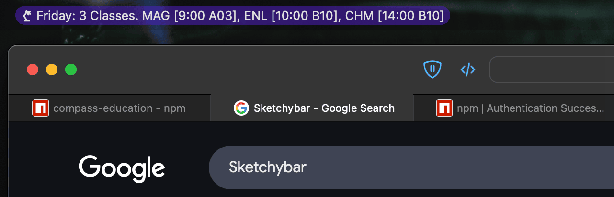

# compass-education

A package to interact with [Compass Education](https://compass.education), a popular school management system in Australia.


## ❗ Disclaimer ❗

This package is unofficial, and is not affiliated with Compass Education in any way. It is not endorsed by Compass Education, and may break at any time. It also does not support all schools. Use at your own risk.

## Installation

Requires Node 18.0.0 or higher for native fetch support.

Please follow [Puppeteer's system requirements](https://pptr.dev/guides/system-requirements).

```bash
# npm users
npm install compass-education
# yarn users
yarn add compass-education
# pnpm users
pnpm add compass-education
# bun users
bun add compass-education
```

## Example 
```ts
import { CompassClient } from 'compass-education';

// Create a new client instance:
const compass = new CompassClient("xxx.compass.education");

(async () => {
  // Log into compass:
  await compass
    .login({
      username: "username",
      password: "password"
    });

  // Fetch my timetable for today:
  const todayTimetable = await compass.getCalendarEvents();
  console.log(todayTimetable);

  // Fetch my timetable for a specific day:
  const specificDayTimetable = await compass.getCalendarEvents({
    startDate: "2022-01-01", // Can also be a Date object.
    endDate: "2022-01-01" // Can also be a Date object.
  });
  console.log(specificDayTimetable);

  // What is my name?
  const userDetails = await compass.getUserDetails();
  console.log(userDetails.fullName);

  // Terminate the session:
  await compass.logout();
})();

```

<details open>
  <summary>Example output of timetable for above example</summary>

  ```ts
  [
    {
      subjectLongName: 'Science',
      subjectTitle: '3SCIH',
      rollMarked: true,
      allDay: false,
      start: '2022-05-17T22:45:00Z',
      finish: '2022-05-17T23:20:00Z',
      longTitle: '10:45: 1 - 3SCIH - B33 - JHD',
      longTitleWithoutTime: '1 - 3SCIH - B33 - JHD',
      period: 1,
      managers: [
        {
          managerUserID: 123456,
          managerIdentifier: 'JHD'
        }
      ],
      locations: [
        {
          locationID: 123456,
          locationName: 'B33'
        }
      ]
    },
    ...
  ]
  ```
</details>

## Endpoint Status
| Endpoint                                             | Implementation | Tests | Description                                           |
|------------------------------------------------------|----------------|-------|-------------------------------------------------------|
| GetCalendarEvents                                    | 🟢              | 🟢     | Timetable data                                        |
| GetUserDetails                                       | 🟢              | 🟢     | Detailed user data                                    |
| GetAllLocations                                      | 🟢              | 🟢     | List of all locations                                 |
| GetAllYearLevels                                     | 🟢              | 🟢     | List of all year levels                               |
| GetAllTerms                                          | 🟢              | 🟢     | List of school defined terms with dates               |
| GetFeedOptions                                       | 🟢              | 🟢     | School news feed data                                 |
| GetAllStaff                                          | 🟢              | 🟢     | List of all staff                                     |
| GetGroupActiviesList (they spelled Activities wrong) | 🟢              | 🟢     | List of all possible group activities e.g. detentions, club sessions, exams |
| GetAllLearningTasksByUserId                          | 🔴              | 🔴     | List all learning tasks (e.g. assignments, homework) |
| GetAllCampuses                                       | 🔴              | 🔴     | List of all school campuses                           |

🟢 = Done
🟡 = Partially done
🔴 = Not done

## Documentation
Coming soon.

## How does this work?

Compass now uses Cloudflare to proxy every route. As a result, directly using endpoints to fetch data is now impossible. As a result, version 1 was sunsetted.

2.0.0+ now uses Puppeteer to bypass Cloudflare. This is way slower (around 8 seconds, depending on your machine) but it is only slow due to browser startup and login. The subsequent endpoint requests are much faster as session cookies are used to make direct endpoint requests. If you have a better solution without needing browser emulation, start a discussion through the Issues tab!

## Project Ideas
Below are some ideas that this package could be used for:
- Building a [Discord](https://discord.com)/[Microsoft Teams](https://www.microsoft.com/microsoft-teams/)/[Guilded](https://www.guilded.gg) bot that fetches timetable data for students:
  - This may be helpful for students who use these social media platforms and want to directly reference their timetable or a specific assignment in a conversation.
- Aggregating data by yourself:
  - Fetch the data and generate statistics or graphs to help you understand your school life better.
  - I have seen my friends use [Notion](https://www.notion.com) to display their timetable and assignments in a more visually appealing way. They have an [API](https://developers.notion.com).
- Display data in a custom way:
  - Fetch the data and display it in a way that suits you better than the Compass interface (you probably only need to query once per day for classes, and once a month for assignments)
    - This saves time, especially if your school has *terrible* Internet.
    - I personally display my classes in a *status bar* through [Sketchybar](https://felixkratz.github.io/SketchyBar/). Linux users may use [Polybar](https://polybar.github.io)
      <details>
        <summary>Click for an example of my status bar</summary>
        
        
      </details>
  - Displaying assignments in a Kanban board.
  - Writing a CLI app that displays your next class, making it easier to know where you need to be. e.g. `nextclass`
  - Loading classes/assignments into task management systems (for example [Todoist](https://todoist.com), [Microsoft To Do](https://to-do.microsoft.com), [TickTick](https://ticktick.com) etc.). I personally use [Things 3](https://culturedcode.com/things/).

## Contributing

Issues and pull	requests are welcome!

Please read the [CONTRIBUTING.md](CONTRIBUTING.md) file for more information. We would love it if you could contribute to this project!

## License

This project is licensed under the MIT License - see the [LICENSE](LICENSE) file for details.